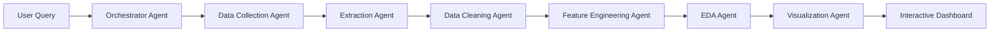
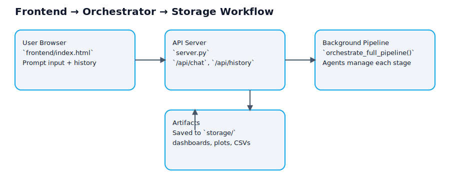

<div align="center">

# 🤖 Autonomous Data Analyst


### 📊 *An autonomous multi-agent system for data collection, cleaning, analysis, and visualization*

> **"Turn websites, datasets, and raw information into insights automatically."**

Autonomous Data Analyst combines specialized AI agents to perform end-to-end analytics workflows — from scraping data to generating interactive dashboards.

🌐 Data Collection • 🧹 Data Cleaning • 🧠 Feature Engineering • 📈 EDA • 📊 Visualization

</div>

---

# 📚 Table of Contents

| 📌 Section | 🔗 Description |
|------------|----------------|
| 🎯 The Vision | Why this project exists |
| 🏗️ Core Architecture | Multi-agent system overview |
| ✨ Features | Key capabilities |
| 🛠️ Tech Stack | Technologies used |
| 🔄 Workflow | Complete pipeline |
| 📂 Repository Structure | Project organization |
| 🚀 Installation | Setup instructions |
| ▶️ Running the Project | Launching backend and UI |
| 📡 API Endpoints | Available APIs |
| 📸 Screenshots | Application preview |
| 🛣️ Future Roadmap | Upcoming enhancements |
| 📄 License | Licensing details |

---

# 🎯 The Vision

Most analytics workflows require multiple tools:

- ❌ Scraping tools
- ❌ Data cleaning tools
- ❌ Feature engineering scripts
- ❌ Visualization software
- ❌ Dashboard builders

### Autonomous Data Analyst changes that.

It creates an intelligent pipeline where specialized agents collaborate to:

> 🌐 Collect data  
> 🧹 Clean datasets  
> 🧠 Engineer features  
> 📈 Analyze trends  
> 📊 Generate dashboards  

All through a single prompt.

---

# 🌟 Core Philosophy

- 🤖 Autonomous Agent Collaboration
- 🔄 End-to-End Analytics Pipelines
- 📂 Transparent Artifact Generation
- 📊 Reproducible Data Science Workflows
- 🚀 Local-First & Developer Friendly
- 🧩 Modular Agent Architecture

---

# ✨ Features

## 🌐 Intelligent Data Collection
- URL extraction from user prompts
- Static scraping via Requests + BeautifulSoup
- Dynamic scraping via Playwright
- Screenshot capture
- Metadata persistence

## 🧹 Automated Data Cleaning
- Missing value handling
- Duplicate removal
- Data standardization
- Dataset profiling

## 🧠 Feature Engineering
- Scaling & normalization
- Skewness correction
- Datetime decomposition
- Feature enrichment

## 📈 Exploratory Data Analysis
- Statistical profiling
- Outlier detection
- Correlation analysis
- Distribution analysis

## 📊 Dashboard Generation
- Interactive Plotly dashboards
- Automated chart generation
- Exportable HTML reports

---

# 🛠️ Tech Stack

| Layer | Technology |
|---------|-------------|
| Backend | FastAPI |
| Agents | Google ADK |
| Scraping | Requests, BeautifulSoup, Playwright |
| Data Processing | Pandas, NumPy |
| Visualization | Plotly, Matplotlib |
| Frontend | HTML, CSS, JavaScript |
| Storage | Local File System |

---

# 🏗️ Core Architecture



### Architecture Diagram

```md

```

---

# 🔄 Workflow

1. Data Collection
2. Extraction
3. Data Cleaning
4. Feature Engineering
5. Exploratory Data Analysis
6. Visualization

### Workflow Diagram

```md

```

---

# 📂 Repository Structure

```text
autonomous_data_analyst/
├── agents/
├── frontend/
├── storage/
├── docs/
├── server.py
├── requirements.txt
└── README.md
```

---

# 🚀 Installation

```bash
python -m venv my-adk-env
my-adk-env\Scripts\activate
pip install -r requirements.txt
python installation_and_setup.py
```

---

# ▶️ Running the Project

```bash
python server.py
```

or

```bash
uvicorn server:app --reload
```

Open:

```text
http://localhost:8000
```

---

# 📡 API Endpoints

| Method | Endpoint |
|----------|----------|
| POST | /api/chat |
| GET | /api/history |
| GET | /api/history/{run_id} |

---

# 📸 Screenshots

<div align="center">

<h3>Autonomous Analytics Dashboard</h3>


<p><i>Live agent logs, analytics summaries, visualizations, and orchestration controls in a unified interface.</i></p>

</div>

---

# 🛣️ Future Roadmap

- 📂 CSV Upload Support
- 📄 PDF Extraction Agent
- 🌐 API Data Connectors
- 📊 Advanced Dashboard Builder
- 🔄 Real-Time Agent Monitoring
- 🤖 LLM-Based Insight Narratives

---

# 📄 License

MIT License
